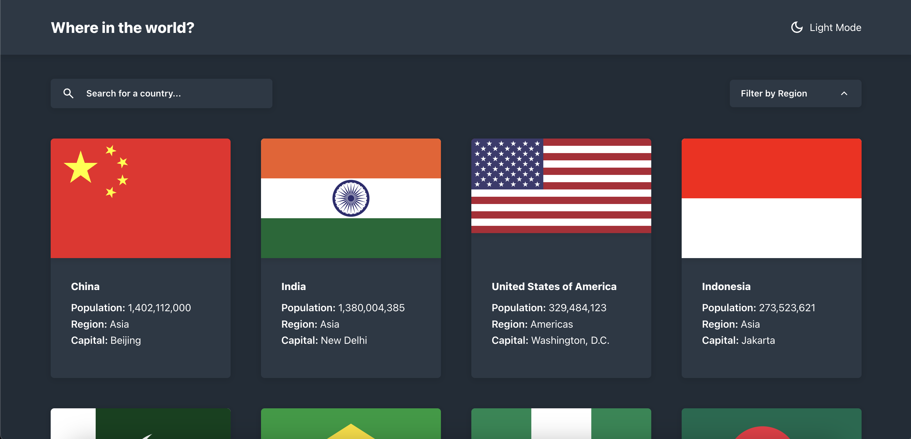

# Frontend Mentor - REST Countries API with color theme switcher solution

This is a solution to the [REST Countries API with color theme switcher challenge on Frontend Mentor](https://www.frontendmentor.io/challenges/rest-countries-api-with-color-theme-switcher-5cacc469fec04111f7b848ca). Frontend Mentor challenges help you improve your coding skills by building realistic projects. 

## Table of contents

- [Overview](#overview)
  - [The challenge](#the-challenge)
  - [Screenshot](#screenshot)
  - [Links](#links)
- [My process](#my-process)
  - [Built with](#built-with)
  - [What I learned](#what-i-learned)
- [Author](#author)

## Overview

### The challenge

Users should be able to:

- See all countries from the API on the homepage
- Search for a country using an `input` field
- Filter countries by region
- Click on a country to see more detailed information on a separate page
- Click through to the border countries on the detail page
- Toggle the color scheme between light and dark mode *(optional)*

### Screenshot

### Links

- Solution URL: [Ahttps://github.com/Esosek/rest-countries](https://github.com/Esosek/rest-countries)
- Live Site URL: [https://esosek.github.io/rest-countries/](https://esosek.github.io/rest-countries/)

## My process

### Built with

- [Astro](https://astro.build/) - Web framework
- [React](https://reactjs.org/) - JS library
- [React CSS Modules](hhttps://create-react-app.dev/docs/adding-a-css-modules-stylesheet/)
- [Typescript](https://www.typescriptlang.org) - Programming language built on Javascript

### What I learned

- How to preserve theme across pages using localStorage
- Working with React Context in Astro

## Author

- Frontend Mentor - [@Esosek](https://www.frontendmentor.io/profile/Esosek)
